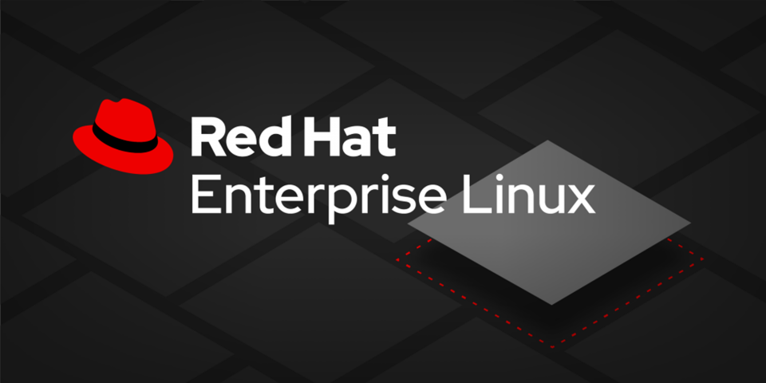

### :star:  RHCSA 
  ---
 
&nbsp;&nbsp;
&nbsp;&nbsp;
 

  ---
**Description:** This is a collection of tasks,labs  that i used to practice and prepare for The Red Hat Certified System Administrator (RHCSA) 
The information below is gatehered  from different [resources](#resources) books (Asghar Ghori, Sander van Vugt) github repos, telegram and slack channels

---
## Talble of Contents
- [Understand and use essential tools](#understand-and-use-essential-tools)
- [Create simple shell scripts](#create-simple-shell-scripts)
- [Operate running systems](#operate-running-systems)
- [Configure local storage](#configure-local-storage)
- [Create and configure file systems](#create-and-configure-file-systems)
- [Automount](#automount)
- [Layered Storage](#layered-storage)
- [Deploy configure and maintain systems](#deploy-configure-and-maintain-systems)
- [Manage basic networking](#manage-basic-networking)
- [Manage users and groups](#manage-users-and-groups)
- [Manage security](#manage-security)
- [Manage containers](#manage-containers)
- [Resources](#resources)

### Understand and use essential tools

- ***Task 1 :***  
	Find all setuid files on the system and save the list

-  ***Task 2 :***   
	Find all log messages in /var/log/messages that contain "ACPI", and export them to a file called /root/logs. 
	Then archive all of /var/log and save it to /tmp/log_archive.tgz

- ***Task 3 :***   
	Create tar files compressed with gzip and bzip2 of /home and extract them

-  ***Task 4 :***  
	Create an empty file hard1 under /tmp and display its attributes. 
	Create hard links hard2 and hard3. Edit hard2 and observe the attributes. Remove hard1 and hard3 and list the attributes again

-  ***Task 5 :***  
	Create an empty file soft1 under /root pointing to /tmp/hard2. Edit soft1 and list the attributes after editing. Remove hard2 and then list soft1

-  ***Task 6 :***  
	 Create a file perm_file1 with read permissions for owner, group and other. 
	 Add an execute bit for the owner and a write bit for group and public. 
	 Revoke the write bit from public and assign read, write, and execute bits to the three user categories at the same time. 
	 Revoke write from the owning group and revoke write and execute bits from public

## Create simple shell scripts 

-  ***Task 1 :***  
	Create a bash script that display the hostname ,system information and the users that  are currently logged in  

-  ***Task 2 :***  
	Create a bash script that shows total count of the supplied arguments , value of the first argument, PID of the script and all the supplied arguments  

-  ***Task 3 :***  
	Create a bash script that can create user10, user20 and user30 accounts with each account is create a message saying " The account is created successfuly " will be displayed otherwise the script will terminate .
	In case of a successful account creation assign the user account a password as their username  

-  ***Task 4:***  
	Write a script that finds all the files owned by new_user and have size greater than 30KB and less than 50KB  and store them in /tmp/

-  ***Task 5 :***  
	Write a script named backup.sh under /root which will search files less than 2M from /usr and store it in /root/backup

-  ***Task 6 :***  
	As a System Administrator you are responsible to take a backup of your /etc directory every night. Build a shell script to take a backup of the /etc/directory using the tar command. The backup script should be named as /root/backup.sh. Schedule this script to run at 11:00 PM every night – except Sundays.

### Operate running systems 

-  ***Task 1 :***  
	Modify the GRUB timeout and make it 1 second instead of 5 seconds

-  ***Task 2 :***  
	Terminate the boot process at an early stage to access a debug shell to reset the root password

-  ***Task 3 :***  
	 Download the latest available kernel packages from the Red Hat Customer Portal and install them 

-  ***Task 4 :***  
	 Install the tuned service, start it and enable it for auto-restart upon reboot. Display all available profiles and the current active profile. Switch to one of the available profiles and confirm. Determine the recommended profile for the system and switch to it. Deactive tuning and reactivate it

-  ***Task 5:***  
	Launch the command dd if=/dev/zero of=/dev/null three times as a background job.
	Increase the priority of one of these ps
	Change the priority of the same process again, but this time use the value -15. Observe the difference.
	Kill all the dd processes you just started

-  ***Task 6 :***  
	Configure the journal to be persistent across system reboots.
	Make a configuration file that writes all messages with an info priority to the file /var/log/messages.info.
	Configure logrotate to keep ten old versions of log files

-  ***Task 7:***  
	Copy the /etc/hosts file to the /tmp direcotry on server2 using scp command. 
	Try to connect to server2 as user root and copy the /etc/passwd file to you home direcotry 

-  ***Task 8 :***  
	Donwload and install the apache web service. try to configure apache to log error messages through syslog using the facility local1
	Create a rule that send all messages that it receives from local1 (That used above) facility to /var/log/httpd-error.log  
	verify the last changed by accessing a page that does not exist 

### Configure local storage 

-  ***Task 1 :***  
	Create a 2 GB gpt partition and format the partition with xfs and mount the device persistently 

-  ***Task 2 :***  
	 Assign partition type "msdos" to /dev/sdc for using it as an MBR disk. Create and confirm a 100MB primary partition on the disk
 
-  ***Task 3 :***  
	Delete the sdb1 partition that was created in Task1 above

-  ***Task 4 :***  

	Initialise one partition sdb1 (90MB) and one disk sdc (250MB) for use in LVM. Create a volume group called vgbook and add both physical volumes to it. Use the PE size of 16MB and list and display the volume group and the physical volumes

-  ***Task 5:***  
	Create two logical volumes, lvol1 and lvbook1, in the vgbook volume group. Use 120MB for lvol0 and 192MB for lvbook1. Display the details of the volume group and the logical volumes

-  ***Task 6 :***  
	Add another partition sdb2 of size 158MB to vgbook to increase the pool of allocatable space. Initialise the new partition prior to adding it to the volume group. Increase the size of lvbook1 to 336MB. Display the basic information for the physical volumes, volume group, and logical volume

-  ***Task 7 :***  
	Rename lvol0 to lvbook2. Decrease the size of lvbook2 to 50MB using the lvreduce command and then add 32MB with the lvresize command. Remove both logical volumes. Display the summary for the volume groups, logical volumes, and physical volumes

-  ***Task 8 :***  
	Uninitialise all three physical volumes - sdb1, sdb2, and sdb - by deleting the LVM structural information from them. Use the pvs command for confirmation. Remove the partitions from the sdd disk and verify that all disks are now in their original raw state

-  ***Task 9 :***  
	Create a new logical volume (LV-A) with a size of 30 extents that belongs to the volume group VG-A (with a PE size of 32M). After creating the volume, configure the server to mount it persistently on /mnt

-  ***Task 10 :***  
	Create 1 swap area in a new 40MB partition called sdc3 using the mkswap command. Create another swap area in a 140MB logical volume called swapvol in vgfs. Add their entries to the /etc/fstab file for persistence. Use the UUID and priority 1 for the partition swap and the device file and priority 2 for the logical volume swap. Activate them and use appropriate tools to validate the activation

### Create and configure file systems   

-  ***Task 1 :***  
	Create 2x100MB partitions on the /dev/sdb disk, initialise them separately with the Ext4 and XFS file system types 
	- create mount points called /ext4fs and /xfs1 
	- attach them to the directory structure, verify their availability and usage
	- mount them persistantly using their UUIDS 

-  ***Task 2 :***  
	 Create a volume group called vgfs comprised of a 160MB physical volume created in a partition on the /dev/sdb disk. The PE size for the volume group should be set at 16MB. Create 2 logical volumes called ext4vol and xfsvol of size 80MB each and initialise them with the Ext4 and XFS file system types. Ensure that both file systems are persistently defined using their logical volume device filenames. Create mount points /ext4fs2 and /xfsfs2, mount the file systems, and verify their availability and usage

-  ***Task 3 :***  
	Grow the size of the vgfs volume group that was created above by adding another  disk to it. Extend the ext4vol logical volume along with the file system it contains by 40MB 

-  ***Task 4 :***  
	 Create a directory called /common and export it to server in read/write mode. Ensure that NFS traffic is allowed through the firewall. Confirm the export

-  ***Task 5 :***  
	 Mount the /common that exported in task 4 . Create a mount point called /local. Add the remote share to the file system table for persistence. Create a test file in the mount point and confirm the file creation on the NFS server

-  ***Task 6 :***  
	 Create users user100, user200 and group sgrp with GID 9999. add user100 and user200 to this group.
	 Create a directory /sdir with ownership and owning groups belong to root and sgrp, and set the setgid bit on /sdir  

-  ***Task 7:***  
	 Create a file under /tmp as user100 and try to delete it as user200. Unset the sticky bit on /tmp and try to erase the file again. Restore the sticky bit on /tmp

### Automount 

-  ***Task 1 :***  
	Configure a direct map to automount the NFS share /common that is available from server2. Install the relevant software, create a local mount point /autodir, and set up AutoFS maps to support the automatic mounting. Note that /common is already mounted on the /local mount point on server1 via fstab. Ensure there is no conflict in configuration or functionality between the 2

-  ***Task 2:***  
	On server1 (NFS server), create a user account called user30 with UID 3000. Add the /home directory to the list of NFS shares so that it becomes available for remote mount. On server2 (NFS client), create a user account called user30 with UID 3000, base directory /nfshome, and no user home directory. establish an indirect map to automount the remote home directory of user30 under /nfshome. Observe that the home directory of user30 is automounted under /nfshome when you sign in as user30

-  ***Task 3 :***  
    Configura Autofs 
    - All Ldapuser2 home directory is exported via NFS, which is available on classroom.example.com (172.25.254.254) and your NFS-exports directory is **/home/guests for Ldapuser2**,
    - Ldapuser2's home directory is classroom.example.com:/home/guests/ldapuse2
    - Ldapuser2's home directory should be automount autofs service.
    - Home directories must be writable by their users.
   while you are able to log in as any of the user ldapuser1 through ldapuser20, the only home directory that is accessible from your system is ldapsuser2

### Layered Storage

-  ***Task 1 :***  
	 Install the VDO software packages, start the VDO services, and mark it for autostart on subsequent reboots
	Create a volume called vdo-vol1 of logical size 16GB on the /dev/sdc disk (the actual size of /dev/sdc is 4GB). List the volume and display its status information. Show the activation status of the compression and de-duplication features

-  ***Task 2 :***  
	 Delete the vdo-vol1 volume that was created above and confirm the removal.
	 Create a VDO volume called vdo1 of logical size 16GB on the sdc disk. Initialise the volume with the XFS file system type, define it for persistence using its device files, create a mount point called /xfsvdo1, attach it to the directory structure, and verify its availability and usage

-  ***Task 3 :***  
	Install the Stratis software packages, start the Stratis service, and mark it for autostart on subsequent system reboots

-  ***Task 4 :***  
	Create a Stratis pool called strpool and a file system strfs2 by reusing the 1GB sdb disk. Display information about the pool, file system, and device used. Expand the pool to include another 1GB disk sdc and confirm

-  ***Task 5 :***  
	Destroy the Stratis file system and the pool that was created, expanded in the above tasks. Verify the deletion with appropriate commands

-  ***Task 6 :***  
	Create a new STRATIS volume according to the following requirements:
	- The volume is named  'stratisfs' belongs to 'stratispool'
	- The volume must be mounted permanent under '/stratisvolume'
	- Copy all the files from '/var/log/audit/' and subdirectories to /stratisvolume 
	- Take a  snapshot of  stratisfs named  stratissnap.

### Deploy configure and maintain systems 

-  ***Task 1 :***  
	 As Bob, create a once-off job that creates a file called /testresults/Hello.sh containing the text "Hello World. This is Admin." in 2 days later

-  ***Task 2:***  
	Set the system time zone and configure the system to use NTP

-  ***Task 3 :***  
	Create a periodic job that appends the current date to the file ~/tracking every 5 minutes every Sunday and Wednesday between the hours of 3am and 4am. Remove the ability of bob to create cron jobs 

-  ***Task 4 :***  
	 Create a daily cron job at 4:27PM for the Derek user that runs cat /etc/redhat-release and redirects the output to /home/derek/release

-  ***Task 5 :***  
	Submit a job as user100 to run the date command at 11:30pm on March 31, 2022, and have the output and any error messages generated redirected to /tmp/date.out. List the submitted job and then remove it

-  ***Task 6 :***  
	Access the repositories that are available on the RHEL 8 image. Create a definition file for the repositories and confirm

-  ***Task 7 :***  
	Verify the integrity and authenticity of a package called dcraw located in the /mnt/AppStream/Packages directory on the installation image and then install it. Display basic information about the package, show files it contains, list documentation files, verify the package attributes and remove the package

-  ***Task 8 :***  
	Determine if the cifs-utils package is installed and if it is available for installation. Display its information before installing it. Install the package and display its information again. Remove the package along with its dependencies and confirm the removal

-  ***Task 9 :***  
	Perform management operations on a package group called system tools. Determine if this group is already installed and if it is available for installation. List the packages it contains and install it. Remove the group along with its dependencies and confirm the removal

-  ***Task 10 :***  
	Perform management operations on a module called postgresql. Determine if this module is already installed and if it is available for installation. Show its information and install the default profile for stream 10. Remove the module profile along with any dependencies and confirm its removal

 
### Manage basic networking

-  ***Task 1 :***  
	Create a connection profile for the new network interface on server using a text editing tool. Assign the IP 172.10.10.110/24 with gateway 172.10.10.1 and set it to autoactivate at system reboots. Deactivate and reactive this interface at the command prompt

-  ***Task 2 :***  
	Create a connection profile using the nmcli command for the new network interface that was added to server2. Assign the IP 172.10.10.120/24 with gateway 172.10.10.1, and set it to autoactivate at system reboot. Deactivate and reactivate this interface at the command prompt

-  ***Task 3 :***  
	Update the /etc/hosts file on both server1 and server2. Add the IP addresses assigned to both connections and map them to hostnames . Test connectivity from server to client and from client to server using their IP addresses and then their hostnames

-  ***Task 4 :***  
	Determine the current active zone. Add and activate a permanent rule to allow HTTP traffic on port 80, and then add a runtime rule for traffic intended for TCP port 443. Add a permanent rule to the internal zone for TCP port range 5901 to 5910. Confirm the changes and display the contents of the affected zone files. Switch the default zone to the internal zone and activate it

-  ***Task 5 :***  
	Remove the 2 permanent rules added above. Switch back to the public zone as the default zone, and confirm the changes 

-  ***Task 6 :***  
	Set the system hostname to server1.example.com and alias server1. Make sure that the new hostname is reflected in the command prompt

### Manage users and groups

-  ***Task 1 :***  
	Create three users (Derek, Tom, and Kenny) that belong to the instructors group. Prevent Tom's user from accessing a shell, and make his account expire 10 day from now

-  ***Task 2 :***  
	Add 3 new users alice, bob and charles. Create a marketing group and add these users to the group. Create a directory /marketing and change the owner to alice and group to marketing. Set permissions so that members of the marketing group can share documents in the directory but nobody else can see them. Give charles read-only permission. Create an empty file in the directory

-  ***Task 3 :***  
	Create user300 with the default attributes in the useradd and login.defs files. Assign this user a password and show the line entries from all 4 authentication files

-  ***Task 4 :***  
	For user200 change the login name to user200new, UID to 2000, home directory to /home/user200new, and login shell to /sbin/nologin. Display the line entry for user2new from the passwd for validation. Remove this user and confirm the deletion

-  ***Task 5 :***  
	Configure password ageing for Derek using the chage command . Set the mindays to 7, maxdays to 28, and warndays to 5. Verify the new settings. Rerun the command and set account expiry to January 31, 2022

-  ***Task 6 :***  
	Configure password aging for using the PASSWD command. Set the mindays to 10, maxdays to 90, and warndays to 14, and verify the new settings. Set the number of inactivity days to 5 and ensure that the user is forced to change their password upon next login

-  ***Task 7 :***  

	Create a group called linuxadm with GID 5000 and another group called dba sharing the GID 5000. Add Derek as a secondary member to group linuxadm 

-  ***Task 8 :***  
	Change the linuxadm group name to sysadm and the GID to 6000. Modify the primary group for Derek to sysadm. Remove the sysadm group and confirm

 
### Manage security

-  ***Task 1 :***  
	Create a file acluser as user100 in /tmp and check if there are any ACL settings on the file. Apply access ACLs on the file for user100 for read and write access. Add user200 to the file for full permissions. Remove all access ACLs from the file

-  ***Task 2 :***  
	Generate a password-less ssh key pair using RSA for user100 on server. Distribute the public key to client and attempt to log on to client from server. Show the log file message for the login attempt

-  ***Task 3 :***  
	Remove the sshd service rule from the runtime configuration on server and try to access the server from the client using the ssh command

-  ***Task 4:***  
	Create a directory sedir1 under /tmp and a file sefile1 under sedir1. Check the context on the directory and file. Change the SELinux user and type to user_u and public_content_t on both and verify 

-  ***Task 5 :***  
	Add the current context on sedir1 to the SELinux policy database to ensure a relabeling will not reset it to its previous value. Next, you will change the context on the directory to some random values. Restore the default context from the policy database back to the directory recursively

	tip: chcon write the context to the file sys and not to the policy so everything is overwritten when 
		 the fs is relabeled where the original context is restored from the policy to the file sys 
		 so it's recommended to work with semanage 

-  ***Task 6 :***  
	Add a non-standard port 8010 to the SELinux policy database for the httpd service and confirm the addition. Remove the port from the policy and verify the deletion

-  ***Task 7 :***  
	Create a file called sefile2 under /tmp and display its context. Copy this file to the /etc/default directory, and observe the change in the context. Remove sefile2 from /etc/default, and copy it again to the same destination, ensuring that the target file receives the source file's context

-  ***Task 8 :***  
	Display the current state of the Boolean nfs_export_all_rw. Toggle its value temporarily, and reboot the system. Flip its value persistently after the system has been back up 

### Manage containers 

-  ***Task 1 :***  
	Download the Apache web server container image (httpd 2.4) and inspect the container image. Check the exposed ports in the container image configuration

	UBI images "stands for universal base image" and it is used as the foundation for all of the redhat product : registry.redhat.io/ubi8/httpd-24
	vim - : this is vim func that reads the STDIN 
	The puprose of skopeo: you can inspect the image without the need of pulling the image from the registry
-  ***Task 2 :***  
	Run the httpd container in the background. Assign the name myweb to the container, verify that the container is running, stop the container and verify that it has stopped, and delete the container and the container image

-  ***Task 3 :***  
	Pull the Apache web server container image (httpd 2.4) and run the container with the name webserver. Configure webserver to display content "Welcome to container-based web server". Use port 3333 on the host machine to receive http requests. Start a bash shell in the container to verify the configuration

-  ***Task 4 :***  
	Configure the system to start the webserver container at boot as a systemd service. Start/enable the systemd service to make sure the container will start at boot, and reboot the system to verify if the container is running as expected

&nbsp;&nbsp;if you face this error: Failed to connect to bus [check this link](https://access.redhat.com/discussions/6029491) 

-  ***Task 5 :***  
	Create a container logserver from an image rsyslog in server1 from registry.redhat.io 
	- Configure the container with systemd services by an existing user user10. 
	- Service name should be container-logserver, and configure it to start automatically across reboot. 
	- Configure your host journal to store all journal across reboot, copy all *.journal from /var/log/journal and all subdirectories to /home/user10/container_logserver  
	- Configure automount /var/log/journal from  logserver (container) to
/home/user10/container_logserver when container starts.

### resources 

  - RHCSA Red Hat Enterprise Linux 8 (UPDATED): Training and Exam Preparation Guide (EX200), Second Edition 

  - Red Hat RHCSA 8 Cert Guide: EX200 (Certification Guide) 
      by: Sander van Vugt 
   
  - [Github repo](https://github.com/jrandj/redhat/blob/master/README.md#Exercises)

